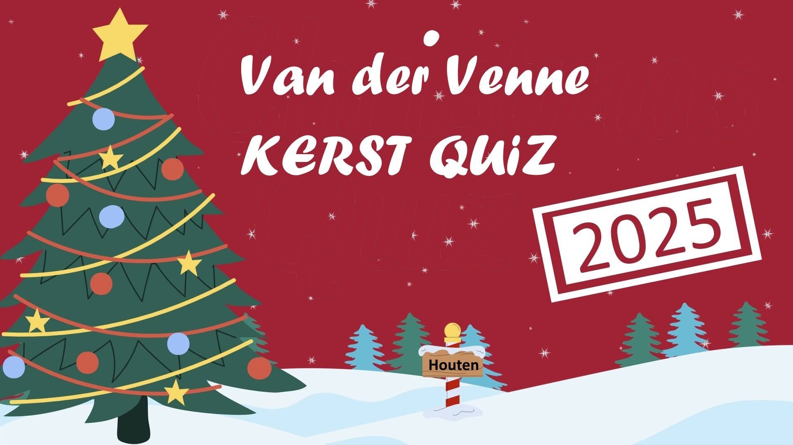

# 🎄 Kerst Quiz 2025

  

  <b>Een interactieve familie kerstquiz 🎅🎁</b> 
  Speel samen, lach samen, en kijk wie er écht oplet tijdens kerst.

  👉 <a href="https://ferrannl.github.io/kerstquiz-2025/"><b>KLIK HIER OM DE QUIZ TE SPELEN</b></a> 👈

---

## 🎉 Wat is dit?

**Kerst Quiz 2025** is een interactieve web-quiz speciaal gemaakt voor familie & vrienden.  
Geen haast, geen stress — gewoon samen vragen beantwoorden, foto’s bekijken en herinneringen ophalen.

Perfect voor:
- 🎄 Kerstavond
- 👨‍👩‍👧‍👦 Familie-momenten
- 😂 Veel lachen aan tafel

---

## 🧠 Wat zit erin?

- 👤 **Spelerselectie met foto’s**
- ❓ **Meerkeuzevragen**
- 🖼️ **Afbeeldingen & GIFs bij vragen**
- ✅ **Direct feedback + uitleg**
- 📊 **Eindoverzicht met goed/fout**
- 🎓 **Diploma / score-overzicht**
- 🔁 Opnieuw spelen wanneer je wilt

Alles draait volledig in de browser — geen account nodig.

---

## 🚀 Direct spelen

👉 **Speel hier de quiz:**  
**https://ferrannl.github.io/kerstquiz-2025/**

(werkt op desktop, tablet en mobiel)

---

## 🛠️ Techniek (simpel gehouden)

- HTML  
- CSS  
- JavaScript  
- GitHub Pages hosting  

Geen frameworks, geen build-steps, gewoon open & spelen.

---

## 📸 Afbeeldingen

Alle afbeeldingen (zoals `fam.jpg`) worden lokaal geladen en zijn onderdeel van de quizbeleving.  
De bovenste afbeelding in deze README is **klikbaar** en brengt je direct naar de quiz.

---

## 🎁 Waarom dit project?

Omdat kerst niet draait om winnen —  
maar om **samen zijn**, **herinneringen**, en **een beetje plagen** 😉  

---

## 🔔 Tip

Open de quiz op één scherm (tv / laptop)  
en speel samen vanaf de bank of eettafel 🎄

---

**Veel plezier & fijne feestdagen! 🎅✨**
